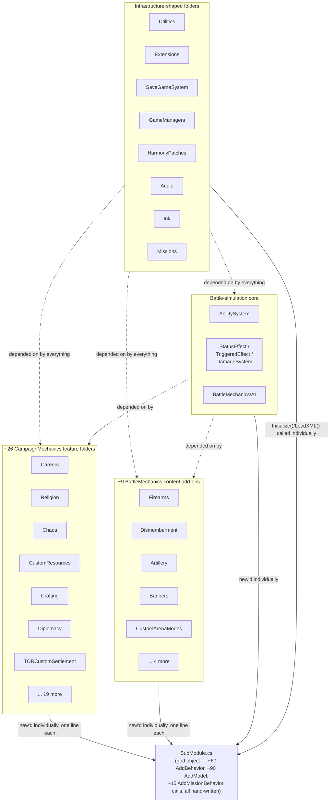

# TOR_Core — Current Architecture Overview

This document describes the codebase as it stands today (`CSharpSourceCode/`), as input to a
proposed vertical-slicing refactor (see [`vertical-slicing-proposal.md`](./vertical-slicing-proposal.md)).

## The shape of the mod

TOR_Core is a single Bannerlord sub-module assembly. Content is organized into ~15 top-level
folders, most named after a technical layer or a broad theme (`CampaignMechanics`,
`BattleMechanics`, `AbilitySystem`, `Models`, ...). Within `CampaignMechanics` and
`BattleMechanics`, there's a second level of folders that map much more closely to actual
features (`Religion/`, `Chaos/`, `Firearms/`, `Crafting/`, ...) — so the raw material for a
feature-oriented ("vertical slice") structure already mostly exists. What's missing is
*isolation*: nothing about a feature's folder makes it self-contained or independently
registrable.

## The registration bottleneck: `SubModule.cs`

Every feature wires itself up by being manually `new`'d in one enormous class,
[`SubModule.cs`](../CSharpSourceCode/SubModule.cs):

| Method | What it does | Approx. count |
|---|---|---|
| `OnSubModuleLoad` | Harmony patching, config/template loading (abilities, status effects, triggered effects, items, banners, careers, voices, ink stories) | ~15 manager `Load`/`Initialize` calls |
| `InitializeGameStarter` | `starter.AddBehavior(new XyzCampaignBehavior())` | ~60 campaign behaviors |
| `OnGameStart` | `gameStarterObject.AddModel(new TORXyzModel())` | ~90 game models |
| `OnMissionBehaviorInitialize` | `mission.AddMissionBehavior(new XyzMissionLogic())` | ~15 mission behaviors |
| `BeginGameStart` | `game.ObjectManager.RegisterType<T>(...)` for custom settlement/career/religion object types | ~13 types |

Every one of these lines is a hard dependency from the "hub" onto a "spoke" feature's concrete
type — `using TOR_Core.CampaignMechanics.Religion;` etc., 65 `using` statements deep. Adding,
removing, or reasoning about one feature in isolation means reading (and safely editing) this
2,600+ line god-object regardless of which feature you actually touch.

## Current wiring

## Observations

- **Folders already suggest features; registration does not respect that.** `CampaignMechanics/Religion/` is a coherent, mostly-self-contained unit of code — but you can't tell that from `SubModule.cs`, where its one `AddBehavior` call sits between unrelated features.
- **Cross-cutting infrastructure is not marked as such.** `Utilities/`, `Extensions/`, `SaveGameSystem/`, `GameManagers/`, `Audio/`, `Ink/`, and most of `HarmonyPatches/` have no feature identity at all — they're pure plumbing every feature depends on, but they sit at the same folder depth as `Chaos/` or `Firearms/`, obscuring the dependency direction.
- **A few systems are structurally "framework" but organizationally trapped inside `BattleMechanics/`**: `AbilitySystem`'s parent concepts (`StatusEffect`, `TriggeredEffect`, `DamageSystem`, `AI`) are the shared combat runtime every spell/prayer/item/career-ability is built on, not a feature themselves.
- **`Models/` is a 90-entry flat registry with no feature grouping at all** — `TORFaithModel` (Religion), `TORCustomResourceModel` (CustomResources), and `TORPartySizeModel` (nothing in particular) all live in the same folder and get added in the same block in `SubModule.OnGameStart`.
- **A handful of files are already colocated correctly** despite the lack of formal structure — e.g. `TORAllianceWarBehavior` carries its own `SaveableTypeDefiner` nested class rather than adding to the central `TORSaveableTypeDefiner`. This is the pattern a vertical-slice structure should generalize.

See [`vertical-slicing-proposal.md`](./vertical-slicing-proposal.md) for the proposed target
shape, a folder-by-folder Framework/Module classification, and a phased migration plan.
