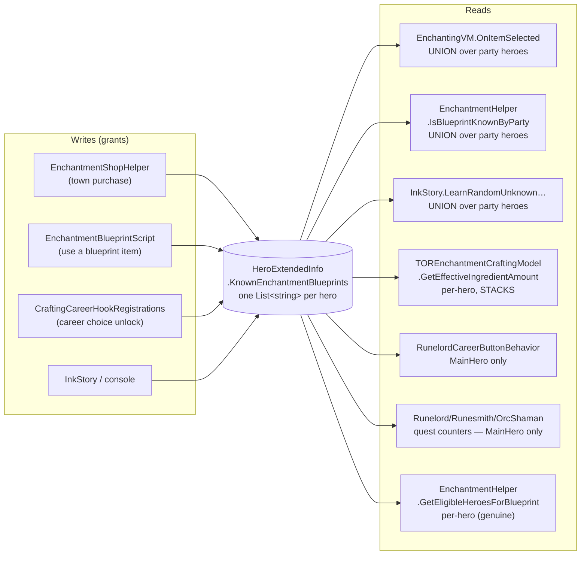
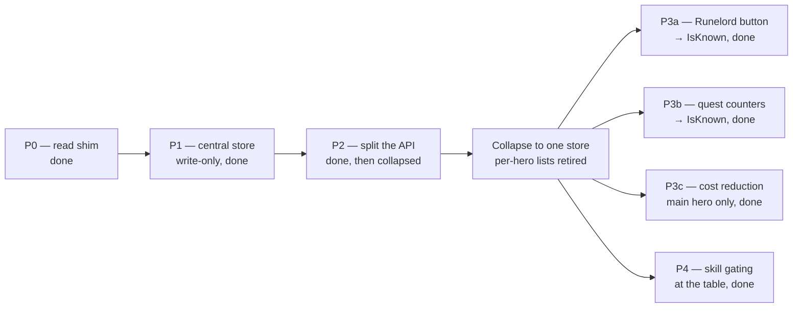

# Enchantment Blueprint Storage — Proposal

Companion to [`vertical-slicing-proposal.md`](./vertical-slicing-proposal.md), scoped to the
Crafting module. Proposes adding a campaign-scoped record of which enchantment blueprints the
party has learned — **alongside**, not instead of, the per-hero lists — and moving skill gating
from purchase time to enchanting-table time.

> **Revised after play-testing.** The first draft proposed replacing the per-hero lists
> outright, on the belief that losing a departing companion's blueprints was a bug. It is not:
> dwarf runes are meant to be learned by a *hired Runesmith*, and keeping that companion is the
> mechanic. The plan now preserves two distinct questions — **known** (ever learned, campaign
> scoped) and **craftable** (a hero present knows it, party scoped) — instead of collapsing
> them. See [the correction](#correction-losing-a-departing-companions-blueprints-is-the-design).

> ## ⚠️ Second revision — the correction above was itself reversed
>
> **Decided during implementation, and it overrides everything below.** The per-hero lists are
> gone. There is one campaign-wide store, blueprints are never lost, and the hired-Runesmith
> *retention* mechanic is retired along with them.
>
> What replaces it is a **crafting-time gate**. Knowing a blueprint and being able to execute it
> are now separate questions:
>
> | Question | Answered by | Scope |
> |---|---|---|
> | Do we know this? | `EnchantmentBlueprints.IsKnown` | campaign, permanent |
> | Can we make it right now? | `EnchantmentHelper.GetUnmetRequirement` | current party, live |
>
> So the Runesmith fantasy survives in a different form: you still need someone who satisfies a
> manuscript's lore/attribute restriction to *learn* a rune, and you still need someone present
> who clears both the restriction and the skill threshold to *craft* with it. You simply no
> longer lose the knowledge when they walk. Skill also stops being a purchase-time toll and
> becomes a live requirement, which is what [Proposal 2](#proposal-2--move-skill-gating-to-the-enchanting-table)
> always wanted.
>
> Sections below that argue for keeping the per-hero lists — chiefly
> [the correction](#correction-losing-a-departing-companions-blueprints-is-the-design) and the
> known/craftable split in [Proposal 1](#proposal-1--add-a-campaign-scoped-known-set-keep-the-per-hero-lists)
> — are kept as a record of the reasoning, not as current intent. The
> [plan of attack](#plan-of-attack) table is up to date and is the authority.

This is a proposal for discussion, not a plan already agreed — see
[Open questions](#open-questions) at the end.

## Current shape

Storage is `HeroExtendedInfo.KnownEnchantmentBlueprints` — `[SaveableField(10)] List<string>`,
one list per `Hero`, living in `Extensions/ExtendedInfoSystem/HeroExtendedInfo.cs`.

**The data is stored per hero but almost never read that way.** Three of the seven read sites
immediately union it back across the party; the granularity only survives in four places, and
three of those are arguably defects:

| Site | Behavior | Assessment |
|---|---|---|
| `TOREnchantmentCraftingModel.GetEffectiveIngredientAmount` | Loops party heroes; the **main hero's** career discount is re-applied once per hero who knows the trait — see correction below | Discount stacks with how many heroes happen to know the same blueprint. Almost certainly unintended. |
| `RunelordCareerButtonBehavior` (`:327`, `:414`) | Reads `Hero.MainHero` only | A rune a companion learned is invisible to the rune-application button, even though the enchanting table offers it. |
| `RunelordQuest` / `RunesmithQuest` / `OrcShamanQuest2` | Count `Hero.MainHero`'s list only | Combined with the shop hiding anything `IsBlueprintKnownByParty`, a companion learning a rune removes it from the shop *and* never credits the quest counter. Already documented in-code at `RunelordQuest.cs:46`. |
| `EnchantmentHelper.GetEligibleHeroesForBlueprint` | Genuinely per-hero | The one load-bearing use — but see below, the gate it enforces doesn't actually come from this list. |

### Correction: the stacking discount did not come from companions' careers

The row above originally read "every hero who knows the trait applies **their own** career
discount". That is wrong, and the distinction matters if anyone ever revisits the rule.

**Companions cannot have careers at all.** Every `AddCareer` call site targets `Hero.MainHero`
— the five character-creation scopes, `CareerSwitchCampaignBehavior`, and the console command —
and `HasCareerChoice` short-circuits on `hero.HasAnyCareer()`. So `EnchantmentCostReductionFactors`
(the Grey Lord hook, the only registered one) correctly returned `0f` for every companion and
never stacked.

The stacking came from `CareerHelper.ApplyBasicCareerPassives`, which **ignores its `hero`
argument when looking up choices**: `RefreshCareerChoicesCache` builds the cache from
`Hero.MainHero.GetAllCareerChoices()`. The hero is used only for `IsValidCharacterObject`, and
all four enchantment-cost choices (Grail Damsel, Imperial Magister, Necrarch, Runelord) are
constructed with a null evaluation function, so that check always passed. The loop therefore
re-applied the *main hero's* discount once per knowing party hero, and `ExplainedNumber` sums
factors — three knowing companions turned −25% into −75%.

This also retires option **(a) best among present knowers** as written: there is no per-hero
discount to take a maximum of. Implementing it would first require careers to exist for
non-player heroes.

### Correction: losing a departing companion's blueprints is the design

An earlier draft of this document listed a fourth defect — that because the table unions over
*current* party members, a companion who leaves takes their blueprints with them. **That is
intended behaviour, not a bug**, and the distinction is the single most important thing in this
document.

`EnchantmentBlueprintScript.OnUse` loops over *every* party hero, so the hero who satisfies a
manuscript's restriction is the one who learns it. For dwarf runes that restriction is
`RuneMagic`, and nothing grants that lore directly — `ExtendedInfoManager.cs:396` and
`HeroExtendedInfo.EnsureKnownLores` derive known lores from known *abilities*, so a hero picks
up `RuneMagic` by knowing a rune ability. In practice the player never has it: **you hire a
Runesmith companion, and they read the manuscripts on your behalf.**

Keeping that companion is therefore a deliberate retention mechanic. A change that let the
player learn every rune, dismiss the Runesmith and keep crafting would quietly delete it.

So the refactor must preserve two *separate* questions that today's single party-union answer
happens to conflate:

| Question | Scope | Authority |
|---|---|---|
| **Known** — has the party ever learned this? | Campaign | the new central store |
| **Craftable** — can we make it *right now*? | Current party | the per-hero lists, unchanged |

The three defects above are all **known**-shaped: they are about counting, attribution and
cost. Only the companion-departure case was **craftable**-shaped, and that one is correct as
it stands.

### The per-hero list isn't what gates learning

Worth being precise, because it's the crux: `GetEligibleHeroesForBlueprint`'s restriction check
reads `info.KnownLores` and `hero.HasAttribute(restriction)` — *not*
`KnownEnchantmentBlueprints`. The list is only consulted to skip heroes who already know the
blueprint. So "only a Death-lore caster can learn Shyish Whisper" survives centralization
untouched; it was never enforced by the stored list.

## Proposal 1 — add a campaign-scoped "known" set, keep the per-hero lists

Add a single `HashSet<string>` on a Crafting-module `CampaignBehaviorBase`, persisted through
behavior-level `SyncData` (which `EnchanterTownBehavior`, `PriestBehavior` and
`TORArtisanDistrictCampaignBehavior` already use).

**The store is additive, not a replacement.** `HeroExtendedInfo.KnownEnchantmentBlueprints`
stays exactly as it is, because craftability depends on knowing *which hero* knows what — see
the correction above. This is a change from the first draft, which proposed deleting the
per-hero lists outright, and it makes the whole plan considerably cheaper:

- No `[SaveableField(10)]` removal, so no "never renumber" hazard and no one-release
  deprecation window.
- No destructive migration. Seeding the store from existing hero lists is purely additive.
- Every phase becomes revertible by deleting code, not by restoring save data.

Behavior-level `SyncData` means **no `TORSaveableTypeDefiner` id is needed** for the new store
either.

### Two read methods, not one

The API needs to make the known/craftable split explicit, because a single `IsKnown` invites
exactly the conflation this document is correcting:

| Method | Answers | Backed by |
|---|---|---|
| `IsKnown(id)` / `GetKnown()` | has the party ever learned this? | the central store |
| `IsCraftable(id)` / `GetCraftable()` | does a hero currently present know it? | party union over the per-hero lists |

Phase 0 shipped a single `IsKnown`/`GetKnown` pair implemented as the party union, on the
belief that the two concepts were the same. They are not, so phase 2 splits the pair and
re-points each caller at whichever one it actually meant.

### Why this branch specifically

`KnownEnchantmentBlueprints` is a Crafting concept living in `Extensions/ExtendedInfoSystem`,
which `vertical-slicing-proposal.md` classifies as **Framework**. That is exactly the
arrow-pointing-the-wrong-way its key invariant calls out. Centralizing it into the module
deletes a Framework → module data coupling *and* takes the save data with it — the same move
the proposal recommends for `SaveGameSystem` type definitions.

### Which call site gets which

| Call site | Wants | Why |
|---|---|---|
| `EnchantingVM.OnItemSelected` (the table) | **Craftable** | The retention mechanic lives here. Unchanged from today's behaviour. |
| `RunelordCareerButtonBehavior` | **Craftable** | Applying a rune to a unit is a crafting act; it should need a hero present who knows it. Still a fix — today it reads `Hero.MainHero` only, so a companion-known rune is invisible. |
| `RunelordQuest` / `RunesmithQuest` / `OrcShamanQuest2` counters | **Known** | Progress already made should not un-count because a companion left. Closes the desync at `RunelordQuest.cs:46`. |
| `TOREnchantmentCraftingModel.GetEffectiveIngredientAmount` | **Craftable** | A discount comes from a hero who is actually here. Also stops it stacking per knowing hero. |
| `EnchantmentShopHelper.GetPurchasableBlueprints` / `HasAnyLearnableEnchantmentRecipe` | **Craftable** *(decided)* | Keeps today's behaviour exactly, so P2 stays a pure re-pointing exercise. A blueprint whose only knower has left returns to the shelf and a present hero can re-learn it — the gold-and-resource sink. Revisitable on its own merits later. |
| `InkStory.LearnRandomUnknownOrionEnchantment` | **Known** | Avoids re-granting something already learned once. |

### Migration

Seed the store on `OnAfterSessionLaunchedEvent` by unioning the current party's per-hero lists,
and record subsequent grants from the `EnchantmentLearned` event. Both are additive and
idempotent, so the seed can simply re-run every launch and self-heal.

Nothing is removed and no save field is retired, so there is no deprecation window and no
save-compatibility risk.

### The decision it still forces

Career cost reduction currently stacks once per knowing hero. Scoping it to **craftable**
narrows the field to heroes present, but does not by itself answer whose discount applies:

| Option | Behavior | Trade-off |
|---|---|---|
| ~~**(a) Best among present knowers**~~ *(not implementable — see the correction above; companions have no careers)* | `presentKnowers.Max(discount)` | Predictable, keeps the hired-Runesmith fantasy meaningful. |
| (b) MainHero only | Only the player's career matters | Simplest; drops the companion fantasy entirely. |
| (c) Keep stacking | Status quo | Rewards duplicating the same blueprint across heroes, which nothing else in the design does. |

## Proposal 2 — move skill gating to the enchanting table

Skill is currently checked in three places under three different rules, and *not* checked in
the one place it would matter:

| Where | Rule today |
|---|---|
| `EnchantmentShopHelper.CreateInquiryElement` | Row **disabled** unless some eligible hero has `skill >= requiredSkillValue`. Note the eligible list itself is built with `requireRequiredSkill: false`, so skill gets evaluated twice, two different ways. |
| `EnchantmentBlueprintScript.OnUse` | Hard filter — a hero under the threshold isn't even offered. |
| `EnchantingVM.OnItemSelected` (the table) | **No skill check at all.** |

So skill is a purchase-time toll with no ongoing meaning: buy at Smithing 150, drop Smithing to
0, craft it forever. And inversely, being 5 points short shows a greyed row the player can do
nothing about except leave and come back.

**Agreed — the check belongs at the table.** Reasons, in order of weight:

1. It becomes a *live* requirement instead of a one-time toll. Skill starts actually mattering.
2. It removes the dead-end greyed row. Buying a recipe you can't yet execute becomes a
   legitimate goal to work toward — purchase is acquiring the knowledge, skill is being able to
   execute it. That's the better progression story.
3. One rule in one place instead of three variants.
4. It kills the `SelectRecipientHero` null path: with 2+ eligible heroes and MainHero not among
   them, `FirstOrDefault(x => x == Hero.MainHero)` returns null and the purchased blueprint
   silently becomes an inventory item instead of being learned.

Is there *any* benefit to the purchase-time lock? One, and it's weak: it stops the player
spending gold and custom resource on something unusable. That's better served by a tooltip
warning than a disabled row — and the current implementation doesn't deliver it consistently
anyway, since career-granted blueprints
(`CraftingCareerHookRegistrations`) bypass the shop entirely.

### Caveats worth deciding up front

- **Don't hide, disable.** A known-but-unusable blueprint must still appear in the table,
  greyed, with "Requires Smithing 150" — otherwise the player thinks they lost it. This is the
  same mistake the current party-union makes when a companion leaves.
- **Whose skill?** Recommend best-in-party, matching option (a) above. Consistency between the
  cost-reduction rule and the skill rule matters more than which one is picked.
- **Career grants would newly be gated.** Runelord/Imperial Magister blueprints arrive without
  passing through the shop, so today they skip skill checks entirely. A table-time check starts
  applying to them — a real balance change on those careers, and worth a deliberate call rather
  than shipping it as a side effect.

## Plan of attack

Sequenced so that the risky change (save format) lands *before* anything reads it, and the
behavior changes land one at a time afterwards. Each phase is independently shippable and
independently revertible.

All phases are now implemented and awaiting a single consolidated test pass — see
[`testplans/p2-p4-single-store-migration.md`](./testplans/p2-p4-single-store-migration.md).

| Phase | Change | Behavior change? | Verify | Revert |
|---|---|---|---|---|
| **P0** *(done)* | Add `EnchantmentBlueprints.IsKnown/GetKnown`, implemented as *today's* party union. Point the three union call sites at it (`EnchantingVM.OnItemSelected`, `IsBlueprintKnownByParty`, `InkStory`). Storage untouched. | **No** — byte-identical apart from the table's trait list now being globally name-sorted | Enchanting table offers the same traits as before | Trivial |
| **P1** *(done)* | Add `EnchantmentBlueprintBehavior` (`List<string>` + runtime `HashSet` + `SyncData`), fed by the `EnchantmentLearned` event and an additive seed on `OnAfterSessionLaunchedEvent`. **Nothing reads the set yet.** | **No** — set is write-only | `tor.check_enchantment_blueprint_store`; see the P1 test plan | Safe: no reader depends on it |
| **P2** *(done)* | Split the shim: `IsKnown/GetKnown` read the central store, new `IsCraftable/GetCraftable` keep the party union. Re-point each caller per the table above — the enchanting table, the shop and `HasAnyLearnableEnchantmentRecipe` move to `IsCraftable`; `InkStory` takes `IsKnown`. | **No**, apart from one deliberate exception: `InkStory.LearnRandomUnknownOrionEnchantment` will no longer re-grant an Orion enchantment the party learned and then lost with a departing hero | Table still loses a departed companion's runes; store still remembers them. See the P2 test plan | Point everything back at `GetCraftable` |
| **Collapse** *(done)* | Retire the per-hero lists outright. `HeroExtendedInfo.KnownEnchantmentBlueprints` and its `[SaveableField(10)]` slot are **deleted**, along with `IsCraftable`/`GetCraftable` and the `Hero.AddEnchantmentBlueprint`/`HasKnownEnchantmentBlueprint` extensions. All grants go through `EnchantmentBlueprints.Learn`. | **Yes** — a departing hero no longer takes blueprints with them; the retention mechanic is retired. **Breaks existing saves** (see below) | Dismiss the only knower, reopen the table: the enchantment is still listed | Not meaningfully revertible — the save field is gone |
| **P3a** *(done)* | `RunelordCareerButtonBehavior` (`:327`, `:414`) → `IsKnown` | **Yes** — fixes companion-learned runes being invisible to the button | Companion learns a rune → button sees it | Independent |
| **P3b** *(done)* | Quest counters (`RunelordQuest`, `RunesmithQuest`, `OrcShamanQuest2`) → `IsKnown`; main-hero filters dropped from the `EnchantmentLearned` listeners in `OrcShamanQuest1`/`2` so increments match the new baseline | **Yes** — closes the `RunelordQuest.cs:46` desync *and* the reload-snapback where a runtime increment was recomputed away | Companion learns a rune → counter increments and survives a reload | Independent |
| **P3c** *(done)* | `GetEffectiveIngredientAmount` → main hero only (option (b)) | **Yes** — *balance*: stacking discount goes away | Ingredient cost with 1 vs 3 knowing heroes present is now identical | Independent |
| **P4** *(done)* | Skill check moves to table population and gains a lore/attribute check alongside it; disabled-not-hidden affordance; shop and manuscript stop gating on skill | **Yes** — *balance* | Known-but-unusable blueprint shows greyed with the reason, not hidden | Independent |

### Save compatibility — existing saves are broken, deliberately

There is **no migration path**. `HeroExtendedInfo`'s `[SaveableField(10)]` is deleted rather than
kept as a drained remnant, on the call that this is a game mod and a new campaign is a reasonable
ask. Concretely, for a save written before this change:

- The blueprints it held are unrecoverable — nothing reads that slot any more.
- `HeroExtendedInfo` may not deserialise cleanly at all, so the save can fail to load outright
  rather than merely loading with no blueprints.

**Never reuse field id 10 on `HeroExtendedInfo`.** Old saves still hold a `List<string>` there,
and a differently-typed field claiming the slot would be handed that data.

An earlier draft kept the field private and drained it once on session launch, which preserved
existing saves; that was dropped in favour of the clean deletion. If save continuity ever matters
again, restoring it means re-adding the field, a `ConsumeLegacy…` accessor, and a party-scoped
seed on `OnAfterSessionLaunchedEvent`.

Notes on the sequencing:

- **P0 + P1 are the safety net**, and both are done. Together they get the codebase talking to
  one read point and the store populated and persisted, with behaviour unchanged.
- **P2 is now a re-pointing exercise, not a flip.** Because the store is additive, P2 should be
  behaviour-neutral: every caller keeps the semantics it already had, but says which one it
  means. If any player-visible behaviour changes during P2, that is a mistake in the mapping
  table, not an intended effect.
- **P3a–P3c are the actual player-facing value** and are listed separately on purpose. In the
  original sketch they were invisible side effects of a mega-refactor; each is a real fix that
  deserves its own verification and its own revert.
- **P3c and P4 are balance changes, not refactors.** Different review question ("do we want
  this?" rather than "is this correct?"), so they should not ride along inside a refactor PR.
- **P4 has no dependency on P0–P3** — if the storage work stalls, skill gating can still ship.

### Decisions taken

- ~~Cost-reduction rule.~~ **Option (b), main hero only** — stated as "for now", so revisitable.
- ~~Whether career-granted blueprints become skill-gated.~~ **Yes** — the check now lives at the
  table, which every route reaches, so Runelord/Imperial Magister grants are gated like anything
  else. This is a real balance change on those careers, landed deliberately.
- ~~Shop re-offer semantics.~~ Moot. Nothing is ever un-known, so the shop hides a blueprint
  permanently once learned. The gold-and-resource re-purchase sink no longer exists.
- ~~Whose skill at the table.~~ **Best-in-party**, and one hero must clear the restriction and
  the skill together — a scholar who knows the lore cannot lend it to a smith who has the hands.

### Still open — flagged in code, not blocking

Each of these has a `NOTE FOR REVIEW` at the relevant call site:

- **Cost reduction vs skill gate are resolved differently** — main hero for cost,
  best-in-party for skill. The proposal's own advice was that consistency matters more than
  which rule wins, so these should probably be unified.
  (`TOREnchantmentCraftingModel.GetEffectiveIngredientAmount`, `EnchantmentHelper.GetUnmetRequirement`.)
Save migration is **not** on this list: it was considered and deliberately dropped, see above.

## Open questions

- ~~**Should the shop re-offer a blueprint whose only knower has left the party?**~~
  **Answered during P2: craftable.** `GetPurchasableBlueprints` and
  `HasAnyLearnableEnchantmentRecipe` hide anything already known. Under **known** semantics the
  player could never re-buy it and would be stuck until they re-hired someone who has it; under
  **craftable** it returns to the shelf and a present hero can learn it, costing gold and custom
  resource again — the intended sink, and identical to how the shop already behaved. Picking
  craftable kept P2 behaviour-neutral; switching it to **known** later is a one-word change and
  a balance question, not a refactor question.
- Should the Runelord *unit-rune* application path (`RunelordCareerButtonBehavior`) share the
  same skill rule as the enchanting table, or keep its own? It has a separate
  ingredient-cost path (`GetIngredientCost`, 3× / 2× multiplier) already.
- `OrcShamanQuest2`/`RunelordQuest`/`RunesmithQuest` count blueprints as a progress metric.
  Under **known** semantics a career-granted blueprint counts toward the quest, and counts for
  companions as well as the player. Today it counts only for `Hero.MainHero`. Confirm that is
  the wanted progression before P3b.
- `development` splits the dwarf manuscripts into two tiers — 10 gated on the `RuneCraft`
  attribute (Runelord character-creation origin only) and 21 on the `RuneMagic` lore (anyone
  with a rune ability, so guild-benefit + Runesmith companion qualifies). Commit `313568e4`
  collapsed the first tier into the second on this branch. That is a design change independent
  of this proposal, and should be decided on its own merits.
