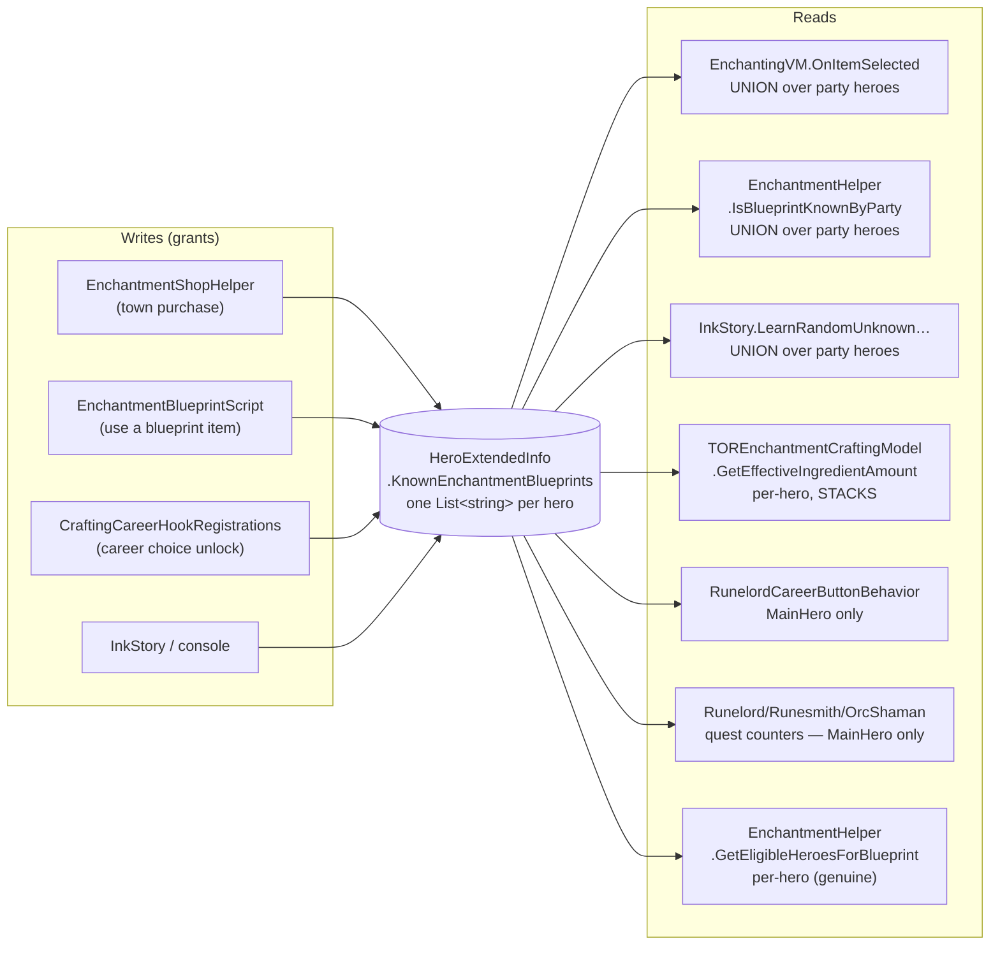
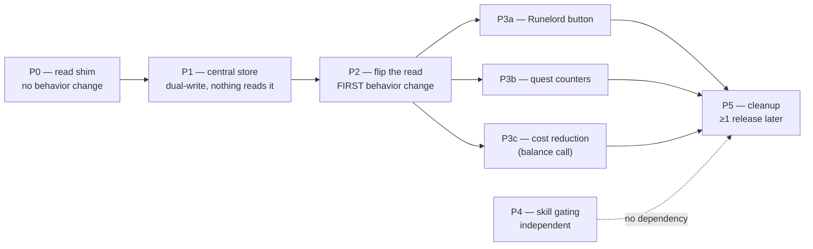

# Enchantment Blueprint Storage — Proposal

Companion to [`vertical-slicing-proposal.md`](./vertical-slicing-proposal.md), scoped to the
Crafting module. Proposes collapsing the per-hero "known enchantment blueprints" lists into a
single campaign-scoped set owned by the Crafting module, and moving skill gating from
purchase time to enchanting-table time.

This is a proposal for discussion, not a plan already agreed — see
[Open questions](#open-questions) at the end.

## Current shape

Storage is `HeroExtendedInfo.KnownEnchantmentBlueprints` — `[SaveableField(10)] List<string>`,
one list per `Hero`, living in `Extensions/ExtendedInfoSystem/HeroExtendedInfo.cs`.

**The data is stored per hero but almost never read that way.** Three of the seven read sites
immediately union it back across the party; the granularity only survives in four places, and
three of those are arguably defects:

| Site | Behavior | Assessment |
|---|---|---|
| `TOREnchantmentCraftingModel.GetEffectiveIngredientAmount` | Loops party heroes; **every** hero who knows the trait applies their own career discount | Discount stacks with how many heroes happen to know the same blueprint. Almost certainly unintended. |
| `RunelordCareerButtonBehavior` (`:327`, `:414`) | Reads `Hero.MainHero` only | A rune a companion learned is invisible to the rune-application button, even though the enchanting table offers it. |
| `RunelordQuest` / `RunesmithQuest` / `OrcShamanQuest2` | Count `Hero.MainHero`'s list only | Combined with the shop hiding anything `IsBlueprintKnownByParty`, a companion learning a rune removes it from the shop *and* never credits the quest counter. Already documented in-code at `RunelordQuest.cs:46`. |
| `EnchantmentHelper.GetEligibleHeroesForBlueprint` | Genuinely per-hero | The one load-bearing use — but see below, the gate it enforces doesn't actually come from this list. |

There is also a silent-loss problem: because the table unions over *current* party members, a
companion dying or leaving takes their blueprints with them. The player loses enchantments they
paid gold + custom resource for, with no notification.

### The per-hero list isn't what gates learning

Worth being precise, because it's the crux: `GetEligibleHeroesForBlueprint`'s restriction check
reads `info.KnownLores` and `hero.HasAttribute(restriction)` — *not*
`KnownEnchantmentBlueprints`. The list is only consulted to skip heroes who already know the
blueprint. So "only a Death-lore caster can learn Shyish Whisper" survives centralization
untouched; it was never enforced by the stored list.

## Proposal 1 — one campaign-scoped set, owned by Crafting

Replace the N per-hero lists with a single `HashSet<string>` on a Crafting-module
`CampaignBehaviorBase`, persisted through behavior-level `SyncData` (which
`EnchanterTownBehavior`, `PriestBehavior` and `TORArtisanDistrictCampaignBehavior` already
use). Either a small new `EnchantmentBlueprintBehavior` or a field on the existing artisan
behavior — a dedicated behavior is cleaner to reason about and to register in `CraftingModule`.

Behavior-level `SyncData` means **no `TORSaveableTypeDefiner` id is needed**, so this sidesteps
the "never renumber" constraint entirely for the new store.

### Why this branch specifically

`KnownEnchantmentBlueprints` is a Crafting concept living in `Extensions/ExtendedInfoSystem`,
which `vertical-slicing-proposal.md` classifies as **Framework**. That is exactly the
arrow-pointing-the-wrong-way its key invariant calls out. Centralizing it into the module
deletes a Framework → module data coupling *and* takes the save data with it — the same move
the proposal recommends for `SaveGameSystem` type definitions.

### What each call site becomes

- `hero.HasKnownEnchantmentBlueprint(id)` → `EnchantmentBlueprints.IsKnown(id)`
- `EnchantmentHelper.IsBlueprintKnownByParty(id)` → the same `IsKnown(id)` call; the helper
  collapses to nothing
- `EnchantingVM.OnItemSelected` — the nested per-hero loop collapses to a single
  `ItemTrait.All.Where(x => x.IsCraftable && IsKnown(x) && ItemTrait.IsValidFor(x, itemType))`.
  The dead debug loop at `EnchantingVM.cs:126–138` (computes `he`/`ve`, throws them away) goes
  with it.
- Quest counters now count the same set the shop hides from — the desync at
  `RunelordQuest.cs:46` closes on its own
- `RunelordCareerButtonBehavior` starts seeing companion-learned runes
- `GetEffectiveIngredientAmount` needs an explicit decision — "each knowing hero stacks a
  discount" stops being expressible, which is the point

### Migration

1. Keep reading `[SaveableField(10)]` for one release.
2. On `OnAfterSessionLaunchedEvent`, union every hero's list into the central set, once.
3. Stop writing field 10. **Never reuse id 10** — per the warning in
   `SaveGameSystem/TORSaveableTypeDefiner`.

### The one real decision it forces

Career cost reduction currently stacks per knowing hero. Once there's one set, "whose career
discount applies?" has to be answered explicitly:

| Option | Behavior | Trade-off |
|---|---|---|
| **(a) Best in party** *(recommended)* | `partyHeroes.Max(discount)` | Predictable, closest to apparent intent, keeps companions meaningful. |
| (b) MainHero only | Only the player's career matters | Simplest; drops the "hire a Runelord companion" fantasy. |
| (c) Attribution map | `Dictionary<blueprintId, heroId>` alongside the set | Preserves current flavour but re-introduces most of the complexity being removed. |

## Proposal 2 — move skill gating to the enchanting table

Skill is currently checked in three places under three different rules, and *not* checked in
the one place it would matter:

| Where | Rule today |
|---|---|
| `EnchantmentShopHelper.CreateInquiryElement` | Row **disabled** unless some eligible hero has `skill >= requiredSkillValue`. Note the eligible list itself is built with `requireRequiredSkill: false`, so skill gets evaluated twice, two different ways. |
| `EnchantmentBlueprintScript.OnUse` | Hard filter — a hero under the threshold isn't even offered. |
| `EnchantingVM.OnItemSelected` (the table) | **No skill check at all.** |

So skill is a purchase-time toll with no ongoing meaning: buy at Smithing 150, drop Smithing to
0, craft it forever. And inversely, being 5 points short shows a greyed row the player can do
nothing about except leave and come back.

**Agreed — the check belongs at the table.** Reasons, in order of weight:

1. It becomes a *live* requirement instead of a one-time toll. Skill starts actually mattering.
2. It removes the dead-end greyed row. Buying a recipe you can't yet execute becomes a
   legitimate goal to work toward — purchase is acquiring the knowledge, skill is being able to
   execute it. That's the better progression story.
3. One rule in one place instead of three variants.
4. It kills the `SelectRecipientHero` null path: with 2+ eligible heroes and MainHero not among
   them, `FirstOrDefault(x => x == Hero.MainHero)` returns null and the purchased blueprint
   silently becomes an inventory item instead of being learned.

Is there *any* benefit to the purchase-time lock? One, and it's weak: it stops the player
spending gold and custom resource on something unusable. That's better served by a tooltip
warning than a disabled row — and the current implementation doesn't deliver it consistently
anyway, since career-granted blueprints
(`CraftingCareerHookRegistrations`) bypass the shop entirely.

### Caveats worth deciding up front

- **Don't hide, disable.** A known-but-unusable blueprint must still appear in the table,
  greyed, with "Requires Smithing 150" — otherwise the player thinks they lost it. This is the
  same mistake the current party-union makes when a companion leaves.
- **Whose skill?** Recommend best-in-party, matching option (a) above. Consistency between the
  cost-reduction rule and the skill rule matters more than which one is picked.
- **Career grants would newly be gated.** Runelord/Imperial Magister blueprints arrive without
  passing through the shop, so today they skip skill checks entirely. A table-time check starts
  applying to them — a real balance change on those careers, and worth a deliberate call rather
  than shipping it as a side effect.

## Plan of attack

Sequenced so that the risky change (save format) lands *before* anything reads it, and the
behavior changes land one at a time afterwards. Each phase is independently shippable and
independently revertible.

| Phase | Change | Behavior change? | Verify | Revert |
|---|---|---|---|---|
| **P0** | Add `EnchantmentBlueprints.IsKnown(id)`, implemented as *today's* party union. Point the three union call sites at it (`EnchantingVM.OnItemSelected`, `IsBlueprintKnownByParty`, `InkStory`). Storage untouched. | **No** — byte-identical | Enchanting table offers the same traits as before | Trivial |
| **P1** | Add `EnchantmentBlueprintBehavior` (`HashSet<string>` + `SyncData`). Dual-write on every grant. One-time migration unions existing hero lists on `OnAfterSessionLaunchedEvent`. **Nothing reads the set yet.** | **No** — set is write-only | Save/load round-trip; on a save with companions, central set == party union | Safe: no reader depends on it |
| **P2** | `IsKnown` reads the central set instead of the union. Hero lists still written as a safety net. | **Yes** — first one | Drop a companion who knew a blueprint; table still offers it | Flip one method body back |
| **P3a** | `RunelordCareerButtonBehavior` (`:327`, `:414`) reads `IsKnown` | **Yes** — fixes companion-learned runes being invisible | Companion learns a rune → button sees it | Independent |
| **P3b** | Quest counters (`RunelordQuest`, `RunesmithQuest`, `OrcShamanQuest2`) count the central set | **Yes** — closes the `RunelordQuest.cs:46` desync | Companion learns a rune → counter increments | Independent |
| **P3c** | `GetEffectiveIngredientAmount` → best-in-party discount (option (a)) | **Yes** — *balance*: stacking discount goes away | Ingredient cost with 1 vs 3 knowing heroes is now identical | Independent |
| **P4** | Skill check moves to table population; disabled-not-hidden affordance; shop stops disabling rows | **Yes** — *balance* | Under-skilled known blueprint shows greyed with reason, not hidden | Independent of P0–P3 |
| **P5** | Drop dual-write, remove `[SaveableField(10)]`, delete `IsBlueprintKnownByParty` and the dead `EnchantingVM.cs:126–138` debug loop | No | Load a pre-migration save | — |

Notes on the sequencing:

- **P0 + P1 are the safety net.** Together they get the whole codebase talking to one API and
  the new store populated and persisted, with behavior provably unchanged. If review only has
  appetite for one thing, land these — they make every later phase a small diff.
- **P2 is the smallest possible "it changed" commit** — one method body. That's deliberate: it
  is the point where blame lands if the enchanting table starts behaving oddly.
- **P3a–P3c are the actual player-facing value** and are listed separately on purpose. In the
  original sketch they were invisible side effects of a mega-refactor; each is a real bug fix
  that deserves its own verification and its own revert.
- **P3c and P4 are balance changes, not refactors.** Different review question ("do we want
  this?" rather than "is this correct?"), so they should not ride along inside a refactor PR.
- **P4 has no dependency on P0–P3** — if the storage work stalls, skill gating can still ship.
- **P5 is gated on a release boundary**, not on P3/P4 merging: per
  [Migration](#migration), field 10 must survive one release before removal, and id 10 must
  never be reused.

### Decide before starting

- Cost-reduction rule — option (a)/(b)/(c) above. Blocks **P3c**.
- Whether career-granted blueprints become skill-gated. Blocks **P4**.

Everything else can be settled in review.

## Open questions

- Set on a behavior vs. keeping a thin `hero.HasKnownEnchantmentBlueprint` shim over it for one
  release, to avoid touching ~10 call sites in the same PR as the storage change?
- Should the Runelord *unit-rune* application path (`RunelordCareerButtonBehavior`) share the
  same skill rule as the enchanting table, or keep its own? It has a separate
  ingredient-cost path (`GetIngredientCost`, 3× / 2× multiplier) already.
- `OrcShamanQuest2`/`RunelordQuest`/`RunesmithQuest` count blueprints as a progress metric.
  With one central set, does a career-granted blueprint count toward the quest? Today it does
  for MainHero and doesn't for a companion — after centralizing, it always would.
