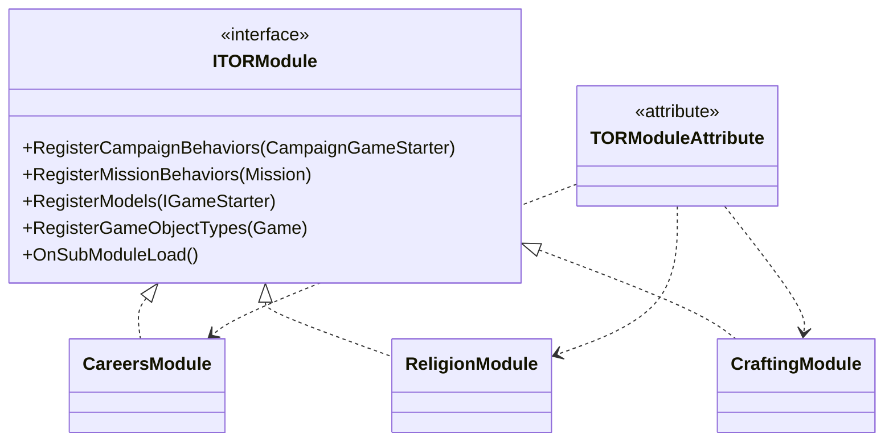

# Vertical Slicing Proposal

Companion to [`architecture-overview.md`](./architecture-overview.md). Proposes splitting
`CSharpSourceCode/` into a **`Framework/`** layer (engine-shaped, no feature toggles, everything
depends on it) and a **`Modules/`** layer (self-contained vertical slices — own behaviors, own
models, own quests, own save data, own UI — each responsible for registering itself).

This is a proposal for discussion, not a plan already agreed — see [Open questions](#open-questions-before-executing)
at the end.

## Goal

Two tests for "is this a Module":

1. **Could a maintainer delete this folder and, modulo a couple of registration lines, have the
   rest of the mod still compile and play?** If yes → Module. If half the codebase reaches into
   it → Framework.
2. **Does it represent one coherent piece of Warhammer content/mechanic** (Religion, Firearms,
   Crafting, the Chaos faction) **or a reusable mechanism** (an effect-resolution pipeline, a
   save-id registry, a view-model injection trick)? Content → Module. Mechanism → Framework.

## Target shape

```mermaid
flowchart TB
    subgraph REG["Registration"]
        SM2["SubModule.cs<br/>(thin: Harmony init, then discovers &amp; drives ITORModules)"]
        REGISTRY["TORModuleRegistry<br/>(reflection scan for [TORModule]-attributed types,<br/>same pattern already used by ViewModelExtensionManager)"]
    end

    subgraph FW["Framework/ — engine-shaped, no feature toggles"]
        direction LR
        FUTIL[Utilities]
        FEXT[Extensions]
        FSAVE[SaveGameSystem]
        FGM[GameManagers]
        FHP[Patches]
        FAUDIO[Audio]
        FINK[Narrative /Ink]
        FMISS[Missions]
        FABIL[AbilitySystem]
        FBATTLE["Battle/<br/>StatusEffect, TriggeredEffect,<br/>DamageSystem, AI"]
        FITEMS["Items<br/>(trait/metadata engine)"]
        FCHARDEV["CharacterDevelopment<br/>(skills/attributes/traits scaffold)"]
        FMODELS["Models<br/>(generic formula overrides)"]
        FQUESTS[Quests infra]
        FEVENTS[CustomEvents]
        FDIALOGUE[Dialogue]
        FUI["UI<br/>(notifications, VM-extension, main menu)"]
    end

    subgraph MODS["Modules/ — self-contained vertical slices"]
        direction LR
        M1["Careers/"]
        M2["Religion/"]
        M3["CustomResources/"]
        M4["Crafting/"]
        M5["Diplomacy/"]
        M6["TORCustomSettlement/"]
        M7["Firearms/"]
        M8["Chaos/, RaiseDead/,<br/>RegimentsOfRenown/, ...<br/>(~20 more, one per mechanic)"]
    end

    SM2 --> REGISTRY
    REGISTRY -- "calls each module's<br/>RegisterCampaignBehaviors/RegisterModels/<br/>RegisterMissionBehaviors" --> MODS
    MODS -- "depends on (read-only)" --> FW
    FW -.no dependency on Modules.-> MODS
```



Key invariant: **arrows only point from `Modules/` into `Framework/`, never back.** If a
`Framework/` class needs to call into a specific module, that's a signal the class isn't
actually framework — either promote the mechanism up (generalize it) or push the call down (let
the module opt in via an event/hook rather than the framework knowing the module by name).

## Proposed registration contract

Replace the hand-written `AddBehavior`/`AddModel`/`AddMissionBehavior` blocks in `SubModule.cs`
with a small interface each module implements once, discovered the same way
`Extensions/UI`'s `ViewModelExtensionManager` already discovers `[ViewModelExtension]` types —
so this isn't a new idiom for the codebase, just the existing one applied to module registration:

```csharp
public interface ITORModule
{
    void RegisterCampaignBehaviors(CampaignGameStarter starter) { }
    void RegisterMissionBehaviors(Mission mission) { }
    void RegisterModels(IGameStarter starter) { }
    void RegisterGameObjectTypes(Game game) { }   // ObjectManager.RegisterType<T>
    void OnSubModuleLoad() { }                     // template/XML loading, if any
}

[AttributeUsage(AttributeTargets.Class)]
public class TORModuleAttribute : Attribute { }
```



`SubModule.cs` shrinks to: Harmony setup, `Framework/` initialization calls (still explicit —
framework pieces have real load-order constraints worth keeping visible), then one
`TORModuleRegistry.DiscoverAndRegister(...)` call per lifecycle hook. Adding a new feature
becomes "add a folder under `Modules/` with a class implementing `ITORModule`" instead of "edit
`SubModule.cs` in five places and hope you didn't collide with someone else's line."

Save-id registration stays centrally *tracked* (id collisions are catastrophic and must be
reviewable in one place) but each module keeps contributing its own `SaveableTypeDefiner`
colocated with its types — generalizing the pattern `Diplomacy/TORAllianceWarBehavior` and
`Diplomacy/HonorAllianceDecision` already use, rather than growing the central
`TORSaveableTypeDefiner` forever.

## Classification

Legend: **FW** = moves to `Framework/`, **MOD** = moves to `Modules/<name>/`, **SPLIT** = the
folder's contents are genuinely mixed and need to be divided.

### Already-framework-shaped top-level folders

| Folder | Verdict | Notes |
|---|---|---|
| `Utilities/` | FW | Uncontroversial — pure cross-cutting helpers already. |
| `SaveGameSystem/` | FW | Keep as the id-ledger; push individual type definitions out to modules over time (see above). |
| `GameManagers/` | FW | Bootstrap, key bindings, shader compilation tracking. |
| `Audio/` | FW | Standalone subsystem, no feature identity. |
| `Ink/` | FW | The Ink *engine* bridge is generic (spawn item/settlement/event/quest/mission/audio); authored `.ink` files are already data, not code. |
| `Missions/` (root) | FW | `TorMissionManager`, `TORMissionAgentHandler`, `MissionExperienceBehavior` are generic mission-launch plumbing used by many modules. |
| `Extensions/` (root ext. methods, `DebugMethods`) | FW | Generic extension methods on vanilla types. |
| `Extensions/ExtendedInfoSystem/` | FW | The side-table *mechanism*; consumed by nearly every module. |
| `Extensions/UI/` (VM-extension framework, `TORInitialScreen`, `MainMenu/`) | FW mechanism, **SPLIT** concrete extensions | `IViewModelExtension`/`ViewModelExtensionManager` stay FW; concrete `CraftingVMExtension`/`RefinementVMExtension` move to `Modules/Crafting/`, etc. — anything named after a specific screen that only one module cares about. |
| `HarmonyPatches/` | mostly FW, **SPLIT** the rest | Engine-wide patches (`AgentPatches`, `MissionPatches`, `ObjectManagerPatches`, `ViewModelPatches`, `GameTextPatches`, `LoadingScreenPatches`, `MainMenuCrashPatch`, ...) stay FW. Patches that only touch one module's own types (`CraftingPatches`, `CustomResourcePatches`, `TournamentPatches`, `ArtilleryPatches`, `ArenaPracticePatch`, `CustomBattlePatches`) move to live beside that module. |

### `AbilitySystem/` and combat runtime — Framework

| Folder | Verdict | Notes |
|---|---|---|
| `AbilitySystem/` (core: `Ability`, `AbilityTemplate`, `AbilityFactory`, `AbilityComponent`, `AbilityManagerMissionLogic`, HUD) | FW | The magic/prayer/career-ability *engine* — every module that grants an ability is a client of this, not a peer. |
| `AbilitySystem/CrossHairs/`, `SpellCasting/`, `Spells/` (+`SpellBook/`), `Spells/Prayers/` | FW | Same engine; Lore/Spell/Prayer data model and its UI are generic magic-system plumbing, not one module's content. |
| `AbilitySystem/Scripts/` | **SPLIT** | Base `AbilityScript` machinery → FW. Per-Career `CareerAbilityScript` subclasses → `Modules/Careers/Abilities/`. |
| `BattleMechanics/StatusEffect/`, `TriggeredEffect/`, `DamageSystem/` | FW | The shared effect-resolution pipeline every spell/item/prayer fires through. |
| `BattleMechanics/AI/` (all of it: `CastingAI/`, `TeamAI/`, `ArtilleryAI/`, `CivilianMissionAI/`, `CommonAIFunctions/`) | FW | Battle-simulation infrastructure, not a toggleable feature — every battle uses it regardless of which content modules are involved. |
| `BattleMechanics/` root (`TORBattleAgentLogic`, `AddAgentComponentsMissionLogic`, `CustomCrosshairMissionBehavior`, `CinematicCameraMissionView`) | FW | Generic mission plumbing. |
| `BattleMechanics/` root — `CareerPerkMissionBehavior` | MOD → `Careers/` | Career-specific despite living at `BattleMechanics/` root today. |
| `BattleMechanics/` root — `TORMonsterSiegeLogic`, `SiegeEarlyVictoryMissionLogic` | MOD → `TORCustomSettlement/` | Monster-siege support exists for Troll Cave content. |

### `BattleMechanics/*` content add-ons — Modules

| Folder | Verdict | Notes |
|---|---|---|
| `Firearms/` | MOD | Self-contained black-powder mechanics. |
| `Dismemberment/` | MOD | Self-contained gore-on-kill logic. |
| `Artillery/` | MOD | Field siege weapons; depends on FW `AI/ArtilleryAI`. |
| `Banners/` | MOD | Custom faction banner content. |
| `CustomArenaModes/` | MOD → `Tournaments/` | Pair with `Missions/ArcheryContestMissionController` + `JoustFightMissionController`. |
| `SniperScope/` | MOD → `Firearms/` | Long-range-weapon scope, used by Firearms content. |
| `Voice/` | FW | Generic battle-shout/voice-over system every agent uses, not one feature. |
| `Morale/` (`UndeadMoraleAgentComponent`) | FW | A core race rule (undead ignore morale), not a toggle. |
| `SFX/` | FW | Generic scene-prop scripting toolkit (spin, face-target, light dampening), reused by whichever module drops a prop in a scene. |

### `CampaignMechanics/` — the bulk of the feature surface

| Folder | Verdict | Notes |
|---|---|---|
| `Assimilation/`, `BountyMaster/`, `Chaos/`, `CharacterCreation/`, `Companions/`, `Crafting/`, `Diplomacy/`, `MasterEngineer/`, `PostBattleLoot/`, `RaidingParties/`, `RaiseDead/`, `RegimentsOfRenown/`, `Religion/`, `ServeAsAHireling/`, `SpellTrainers/`, `TORCustomSettlement/` (+`Component/`, `CustomSettlementMenus/`), `UniqueSpawns/`, `Villages/` | MOD | Already well-isolated folders — the most direct wins. Each becomes `Modules/<Name>/` basically as-is, plus an `ITORModule` implementation. |
| `Careers/` | MOD → merge into `Modules/Careers/` | Along with `CharacterDevelopment/CareerSystem/` (+`Choices/`, `CareerButton/`), `CharacterDevelopment` root's `TORCareers`/`TORCareerChoices`/`TORCareerChoiceGroups`/`CareerAbilityChargeSupplier`, `Quests/Careers/`, and the `AbilitySystem/Scripts` career scripts noted above. This is the largest single module — spans five current top-level folders. |
| `CustomResourceBehavior/` + `CustomResources/` (+`WaaaghMeter/`) | MOD → `Modules/CustomResources/` | The whole per-culture resource system (Prestige/Chivalry/DarkEnergy/ForestHarmony/CouncilFavor/OathGold/Teef/Waaagh) as one module domain. |
| `CustomDialogs/` (+`ConversationTags/`) | FW | A shared "extra conversation lines" surface multiple modules hook into (framework role, similar to `CustomEvents/`) — but audit for module-specific dialog behaviors (e.g. `DuelBehavior`) that should move out. |
| `CustomDialogs/DuelBehavior` | MOD → `Tournaments/` (or its own `Modules/Duel/`) | Honor-duel is one coherent feature, currently colocated in `CustomDialogs/`. |
| `CustomEvents/` | FW mechanism | Generic scripted-event framework (`CustomEvent`, `CustomEventsCampaignBehavior`). |
| `CustomEvents/SimpleCareerQuestBehavior` | MOD → `Careers/` | Career-flavor content colocated in the framework folder today. |
| `MapNotifications/` | FW → `Framework/UI/` | Generic notification popup helper used by every module. |
| Root files: `CampaignEventHelpers`, `TorRecruitmentHelpers`/`TORAIRecruitmentCampaignBehavior`, `TORPartyUpgraderCampaignBehavior`, `TORCaptivityCampaignBehavior`, `TORFactionDiscontinuationCampaignBehavior`, `TORStartupBehavior`, `SkillTrainerBehavior`, `TorMapBarSpriteWidget`, `TORCampaignMusicHandler` | FW | Campaign-wide systems with no single owning feature. |
| Root files: `GreenskinAICampaignBehavior` | MOD → `CustomResources/` (Waaagh) or its own `Modules/Greenskins/` | Greenskin/Waaagh-flavored AI behavior — needs a look at what it actually touches before placing. |
| Root files: `TORSpecialSettlementBehavior` | MOD → `TORCustomSettlement/` | |

### `CharacterDevelopment/` — split

| Folder | Verdict | Notes |
|---|---|---|
| `TORSkills`, `TORSkillEffects`, `TORAttributes`, `TORCharacterTraits`, `TORPerks`, `TORPerkHandlerCampaignBehavior` | FW | Base progression scaffolding every module can add skills/perks/traits into. |
| `TORCareers`, `TORCareerChoices`, `TORCareerChoiceGroups`, `CareerAbilityChargeSupplier` | MOD → `Careers/` | See Careers entry above. |
| `CareerSystem/` (whole subfolder) | MOD → `Careers/` | |

### `Extensions/`, `Items/`, `Models/`, `Quests/` — split

| Folder | Verdict | Notes |
|---|---|---|
| `Items/` root (`ItemTrait`, `ItemTraitManager`, `ItemTraitAgentComponent`, `ExtendedItemObjectManager`/`Properties`) | FW | Generic item-enchantment/metadata engine. |
| `Items/` root (`TorEnchantingIngredients`, item-trait tooltip VMs/widgets) | MOD → `Crafting/` | Crafting-flavored UI colocated in `Items/` today. |
| `Items/InventoryUseScriptsCampaignBehavior` | FW | Generic dispatcher. |
| `Items/WeaponHitScripts/`, `Items/InventoryUseScripts/` | FW interface, **SPLIT** implementations | The `IWeaponHitScript`/`IInventoryUseScript` contracts stay FW; concrete scripts move with whichever module grants the item that uses them. |
| `Models/` (generic combat/party/settlement-economy formula overrides — the majority) | FW | Stays a registration surface, but each `AddModel` call should move to be issued by the owning module (Framework or the module registering itself), not centrally in `SubModule.OnGameStart`. |
| `Models/` — `TORFaithModel` | MOD → `Religion/` | |
| `Models/` — `TORCustomResourceModel` | MOD → `CustomResources/` | |
| `Models/` — `TOREnchantmentCraftingModel`, `TOREnchantmentIngredientsModel`, `TORSmithingModel` | MOD → `Crafting/` | |
| `Models/` — `TORCompanionHiringPriceCalculationModel`, `TORCompanionTrainingModel` | MOD → `Companions/` | |
| `Models/` — `TORHiringCompatibilityModel` | MOD → `ServeAsAHireling/` (verify against usage) | |
| `Models/` — `TORDiplomacyModel`, `TORAllianceModel`, `TORTradeAgreementModel`, `TORKingdomDecisionPermissionModel` | MOD → `Diplomacy/` | |
| `Models/` — `TORVillageProductionCalculatorModel` | MOD → `Villages/` | |
| `Models/` — `TORTournamentModel` | MOD → `Tournaments/` | |
| `Models/` — `TORAbilityModel` | FW → `AbilitySystem/` | Spell damage/radius/duration scaling is engine-level, not one module's. |
| `Models/CustomBattleModels/` | FW | Parallel model set for Custom Battle mode as a whole, not one feature. |
| `Quests/TORQuestHelper`, `QuestPartyComponent` | FW | Generic quest-launch infra used by many modules' content. |
| `Quests/EngineerQuest` | MOD → `MasterEngineer/` | |
| `Quests/SpecializeLoreQuest` | MOD → `SpellTrainers/` | |
| `Quests/HuntCultistsQuestCampaignBehavior` | MOD → `Chaos/` (verify) | |
| `Quests/PlaguedVillageQuestCampaignBehavior` | MOD → `Villages/` or `RaiseDead/` (verify — theme needs a quick read before placing) | |
| `Quests/Careers/` | MOD → `Careers/` | |

## Migration strategy

Doing this in one pass is high-risk on a codebase this size (2,600-line `SubModule.cs`, 90 game
models, `SaveGameSystem` compatibility constraints). Suggested phased order, each phase
independently shippable:

1. **Introduce the mechanism, touch nothing else.** Add `ITORModule`/`TORModuleAttribute`/`TORModuleRegistry` under a new `Framework/` folder (which starts out mostly empty re-exports). No behavior moves yet.
2. **Move the uncontroversial pure-infrastructure folders** (`Utilities/`, `Audio/`, `GameManagers/`, `SaveGameSystem/`) into `Framework/` — pure `namespace`/`using` churn, zero registration risk, builds confidence in the move tooling.
3. **Convert 2–3 already-isolated `CampaignMechanics/` features** (good first candidates: `BountyMaster/`, `PostBattleLoot/`, `Villages/` — small, few cross-references per their CLAUDE.md summaries) to `Modules/` + `ITORModule`, removing their lines from `SubModule.cs`. Validate the registry-discovery approach end-to-end in a real play session before scaling up.
4. **Migrate the rest of the clearly-isolated `CampaignMechanics/*` and `BattleMechanics/*` content folders** module-by-module, each as its own PR (small diff, easy to bisect if something regresses).
5. **Tackle the split folders last** (`Models/`, `Items/`, `Quests/`, `Extensions/UI/`, `HarmonyPatches/`) — these require pulling individual files out of a shared folder rather than moving a whole folder, so they're more error-prone and benefit from the muscle memory built in steps 3–4.
6. **Tackle `Careers/` last of all** — it's the largest and most cross-cutting module (spans five current folders); do it once the pattern is well-proven elsewhere.

Each phase: move files, update `namespace`s, remove the corresponding lines from `SubModule.cs`,
add the module's `ITORModule` implementation, build, and do a smoke playtest (Career/quest
mechanics and save/load in particular, given `SaveGameSystem`'s "never renumber" constraint).

## Open questions before executing

- **Naming**: `Modules/` vs. keeping `CampaignMechanics/`/`BattleMechanics/` as the module root and only carving out `Framework/`? (Renaming touches every file's `namespace`.)
- **Reflection-based discovery** mirrors the existing `ViewModelExtensionManager` pattern, but is a runtime cost/load-order change worth confirming against Bannerlord's startup profiling before committing, vs. an explicit (but still short) list of module types in `SubModule.cs`.
- A few placements above are flagged **"verify"** — `GreenskinAICampaignBehavior`, `TORHiringCompatibilityModel`, `HuntCultistsQuestCampaignBehavior`, `PlaguedVillageQuestCampaignBehavior` — their current CLAUDE.md summaries don't pin down which module they truly belong to; worth a quick source read before moving.
- Should `SaveGameSystem`'s central definer be split by module now, or only for *new* types going forward (leaving existing ids where they are, since renumbering breaks saves)?
